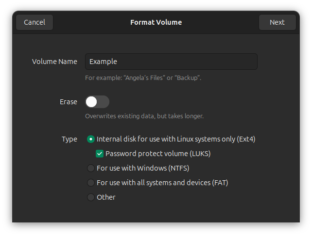

---
# Basic data
slug: 'luks-reference'
title: 'LUKS Reference'
description: 'A reference on how to use LUKS (Linux Unified Key Setup) for managing encrypted drives on Linux.'
isFeatured: true
isPublished: true
tags: []
# Timestamps
createdAt: 2025-03-14T00:00:00.000Z
# Related content
relatedProjects: []
relatedPosts: []
---

LUKS (Linux Unified Key Setup) can be used to handle to creation and access encrypted volumes on Linux.  
If you want to back up or transfer files to external hard drives on Linux, LUKS no further.

This reference is intended to be a high level overview for everyday use, not an exhaustive guide. To learn more, 
try visiting [gitlab.com/cryptsetup/cryptsetup](https://gitlab.com/cryptsetup/cryptsetup) or running `man cryptsetup`.

## Setup
You can set up drives via the terminal, but personally I'm lazy and tend to just use the UI, for example on Ubuntu:




## Usage

If required, find the drive you want to target (for example `/dev/sda1`):
```bash
lsblk
```

Unlock an encrypted drive, supplying your desired `name`:
```bash
sudo cryptsetup luksOpen /dev/sda1 name
```

Mount to decrypted drive:
```bash
sudo mount /dev/mapper/name /mnt/name
```
