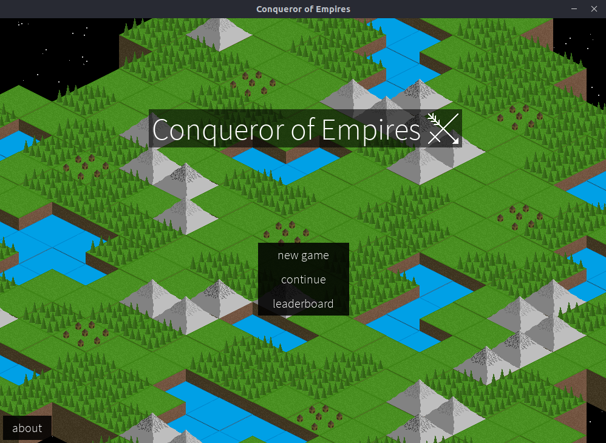
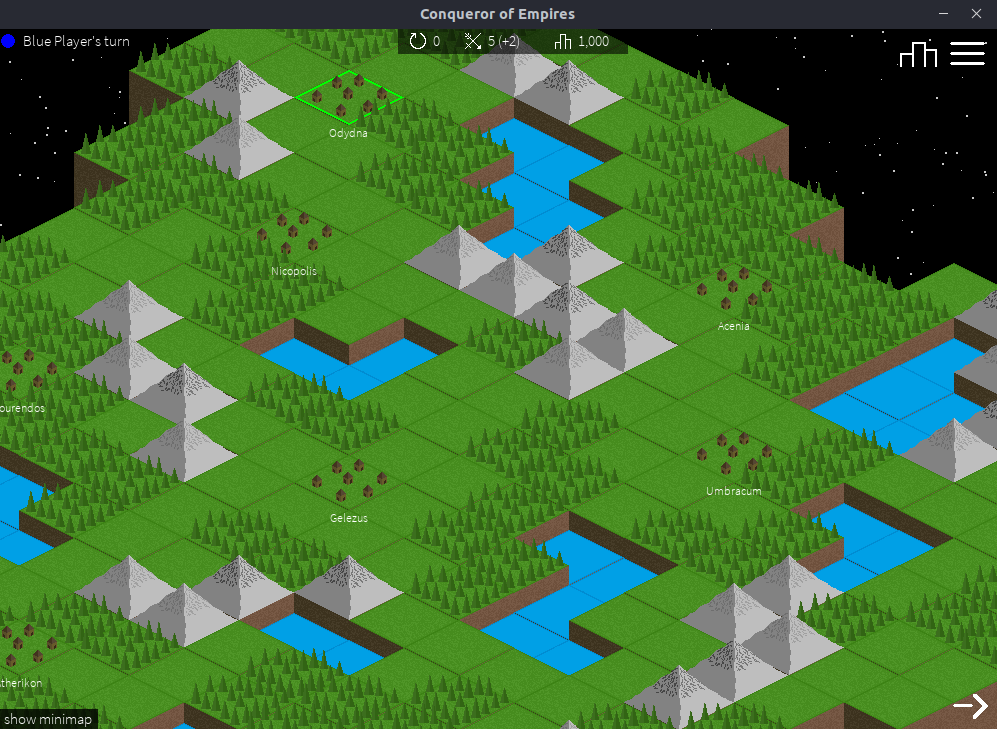
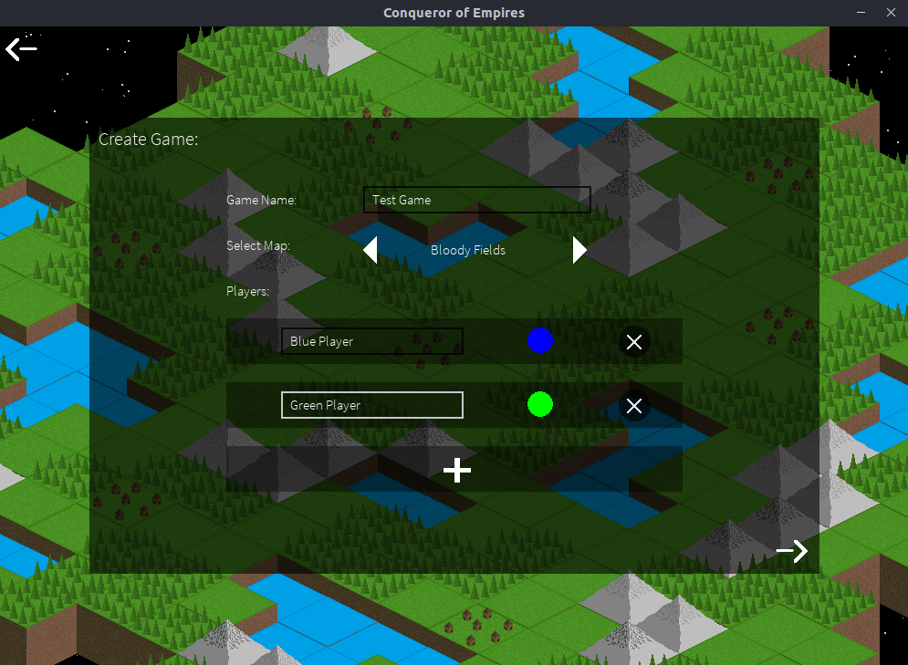
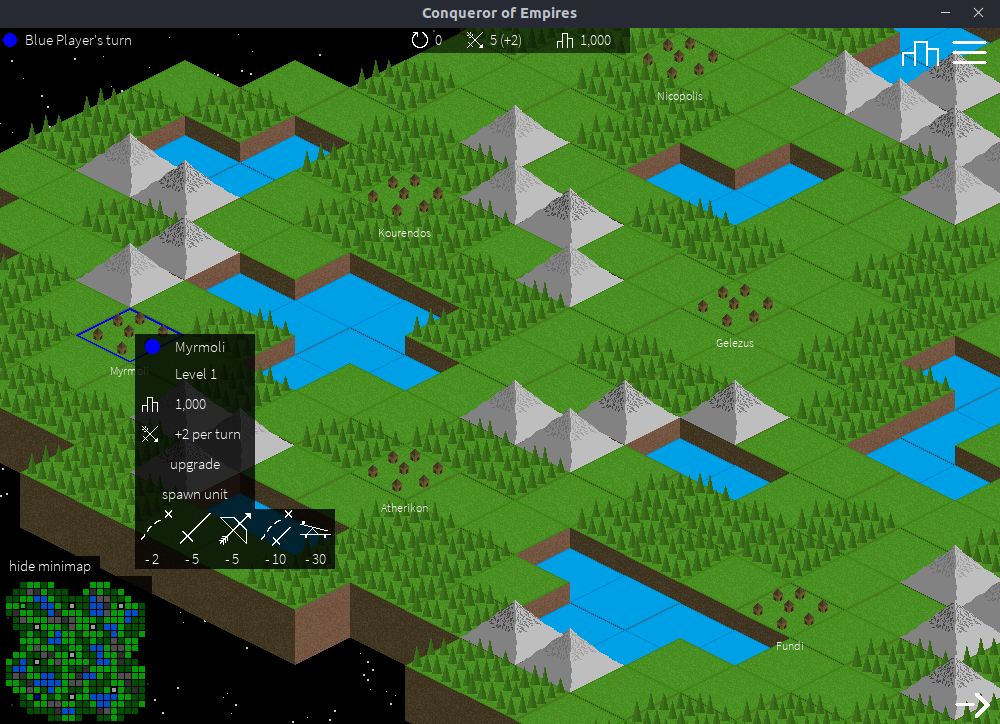
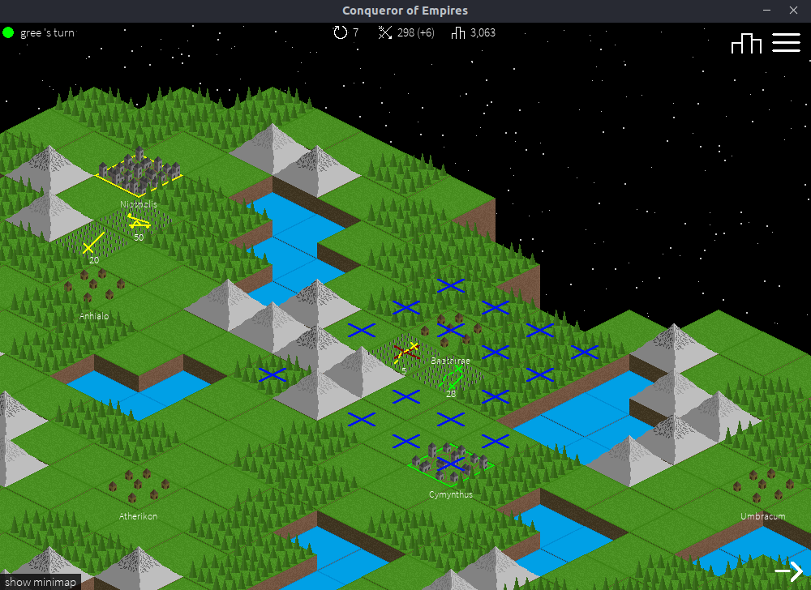
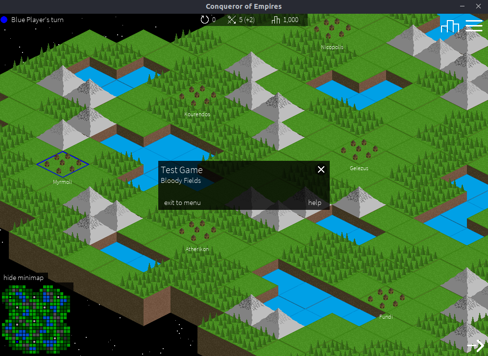
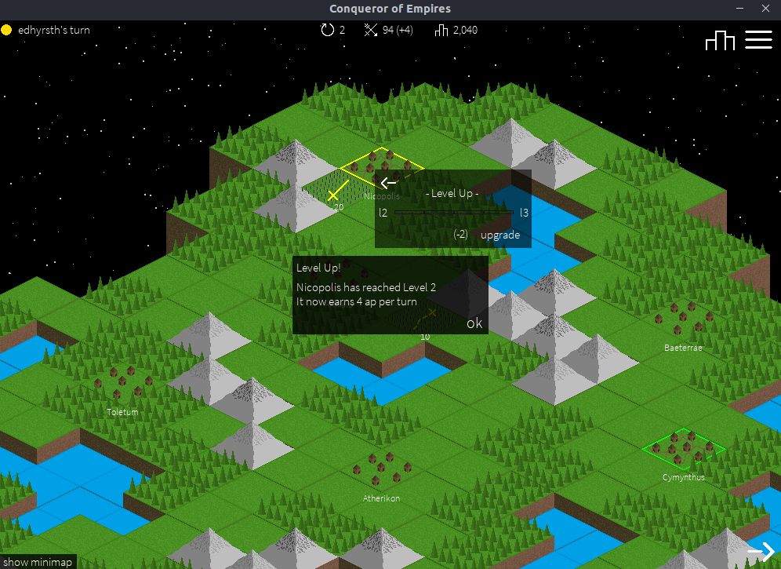

---
# Basic data
slug: 'conqueror-of-empires'
title: 'Conqueror of Empires'
description: 'A turn-based strategy game where up to 4 local players battle to be victorious, by expanding their empires, and controlling units to conquer cities and attack the enemy.'
tags:
  - games
# Project data
isFeatured: true
releasedAt: 2020-04-30T00:00:00.000Z
repositoryUrl: "https://github.com/Ben-Ryder/Conqueror-of-Empires"
# Timestamps
createdAt: 2023-10-07T00:00:00.000Z
updatedAt: 2023-10-14T00:00:00.000Z
publishedAt: 2023-10-07T00:00:00.000Z
# Related content
relatedBlogPosts: []
relatedProjects:
  - escape
---

Conqueror of Empires is a turn-based strategy game where up to 4 local players battle to be victorious, by expanding their empires, and controlling units to conquer cities and attack the enemy.

The game was inspired by [Polytopia](http://midjiwan.com/polytopia.html) and [Civilisation](https://civilization.com/) and was made using python and pygame.

You can find the source code on my [GitHub](https://github.com/ben-ryder/Conqueror-of-Empires) or you can download it from the [GitHub Releases](https://github.com/ben-ryder/Conqueror-of-Empires/releases).

## Gallery

