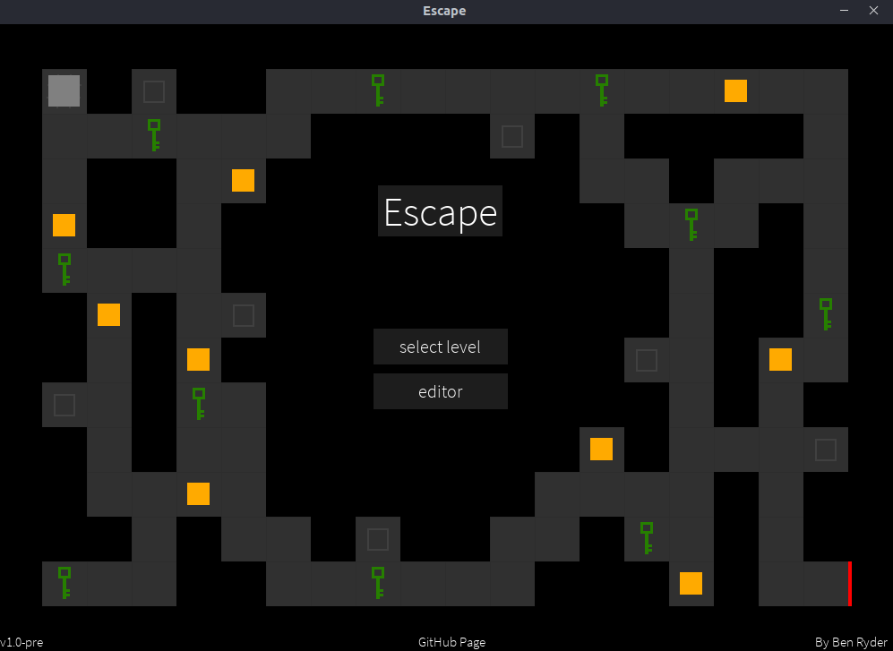
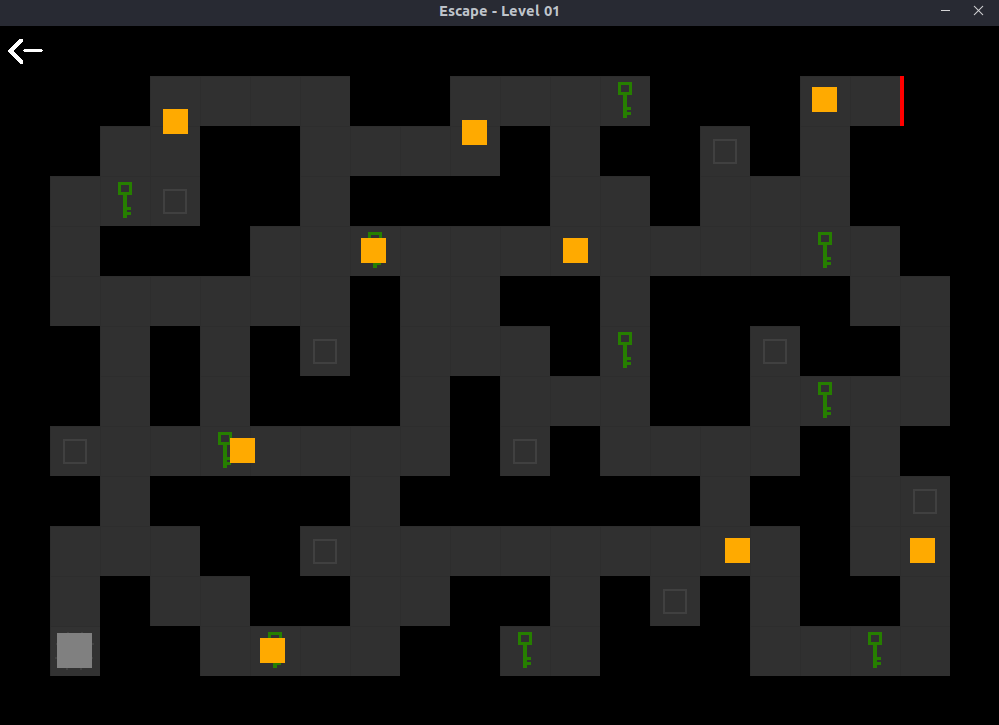
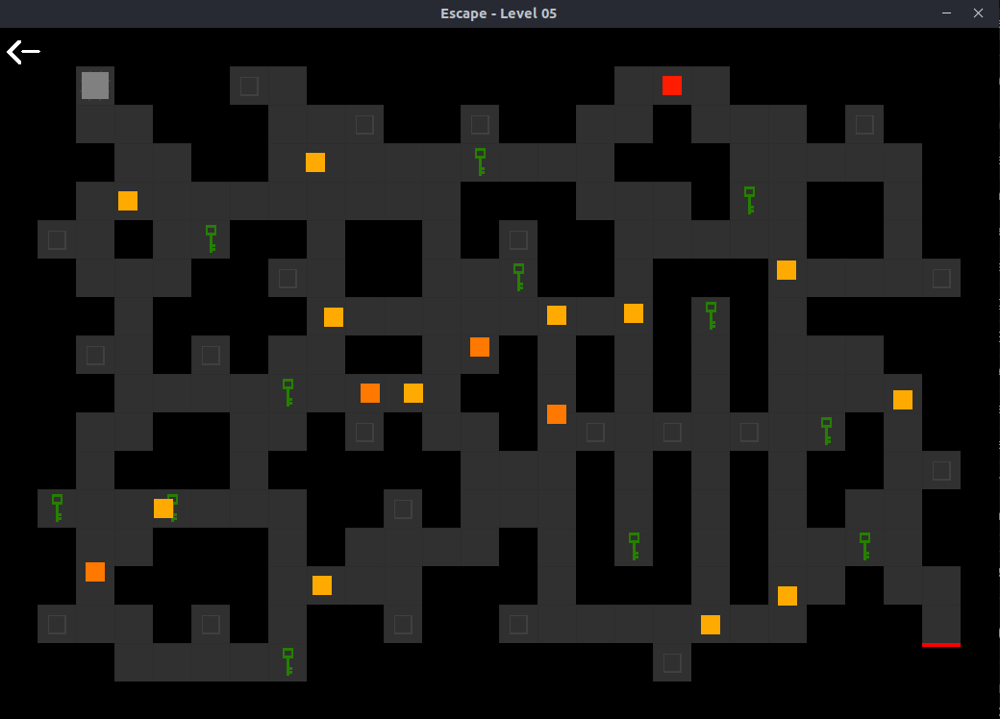
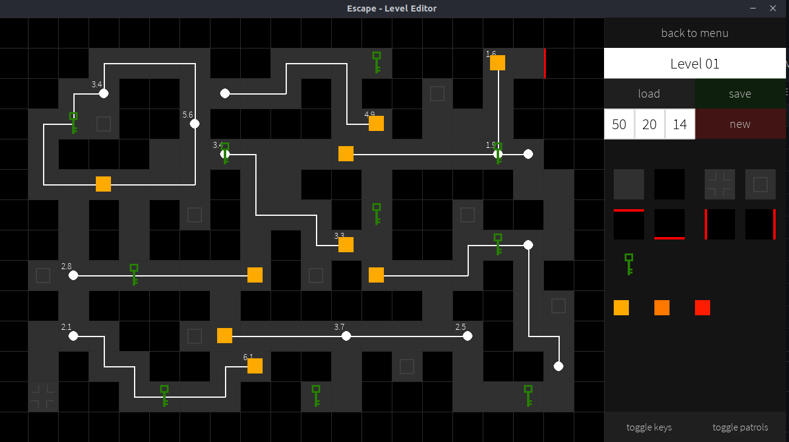

---
# Basic data
slug: 'escape'
title: 'Escape'
description: "You are trapped. To escape you must collect all the keys and get to the exit while avoiding all enemy patrols. If they touch you, you're dead."
tags:
  - games
# Project data
isFeatured: false
releasedAt: 2020-05-26T00:00:00.000Z
repositoryUrl: "https://github.com/ben-ryder/escape"
# Timestamps
createdAt: 2023-10-07T00:00:00.000Z
updatedAt: 2023-10-14T00:00:00.000Z
publishedAt: 2020-05-26T00:00:00.000Z
# Related content
relatedBlogPosts: []
relatedProjects:
  - conqueror-of-empires
---

Escape is a dungeon crawler style game where the player has to try and escape. This is achieved by collecting all the keys and making it to the exit while avoiding all enemies.

This was the first game where I tried to implement some more advanced game mechanics and algorithms. Enemy patrols follow a set path which they traverse using an implementation of the [A\* shortest path algorithm](https://en.wikipedia.org/wiki/A*_search_algorithm).
There is also an enemy seeker which will seek out the player by continually working out the shortest path to them.
If you're interested in the algorithm you can check it out [here](https://github.com/Ben-Ryder/Escape/blob/master/project/game/search.py).

## Gallery

