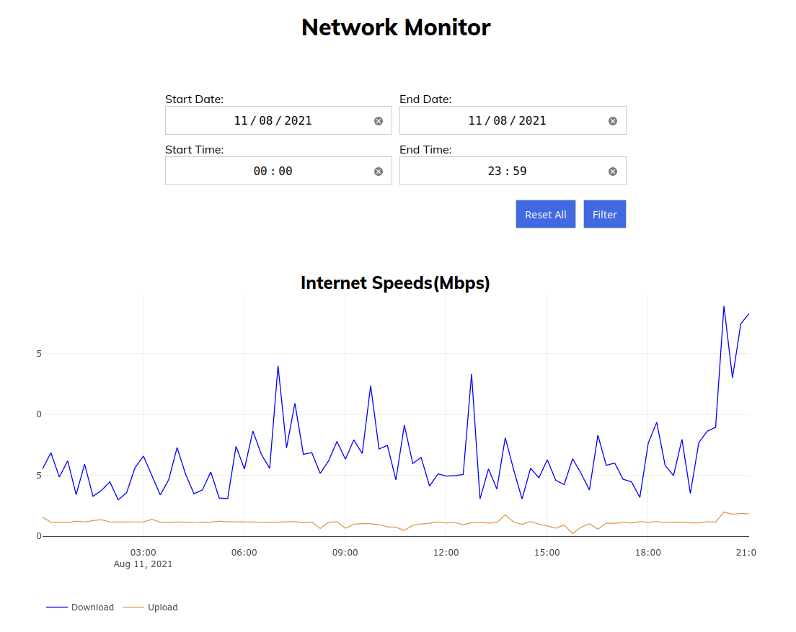
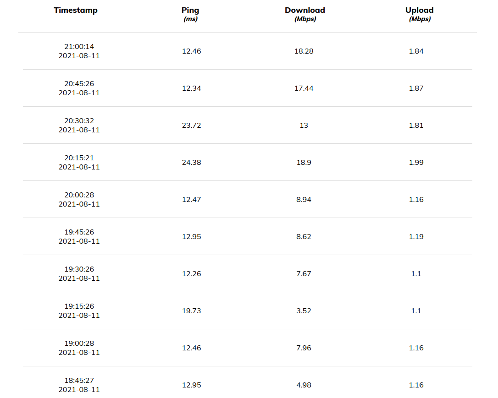

---
# Basic data
slug: 'network-monitor'
title: 'Network Monitor'
description: 'A dashboard for measuring and visualising your internet speeds.'
tags:
  - apps
  - home-lab
# Project data
isFeatured: false
releasedAt: 2020-07-22T11:00:00.000Z
repositoryUrl: "https://github.com/ben-ryder/network-monitor"
# Timestamps
createdAt: 2023-10-07T11:19:43.677Z
updatedAt: 2023-10-14T17:29:19.090Z
publishedAt: 2020-07-22T11:00:00.000Z
# Related content
relatedBlogPosts: []
relatedProjects: []
---

A simple website built with Node.js, Express.js and MySQL to automatically monitor your network speeds. The results can then be viewed and filtered on the site in a list or graph format.

The system uses a configurable cron job which then calls [speedtest-net](https://www.npmjs.com/package/speedtest-net) to do the actual speed test.
It's a simple service which is great to run on something like a Raspberry Pi which can be connected directly to the router via ethernet and left to run 24/7.

## Screenshots

