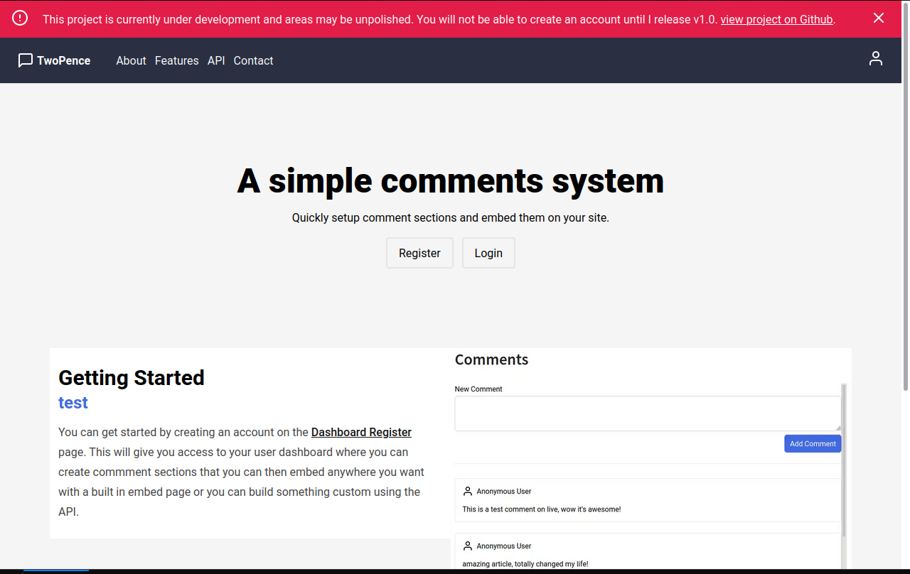
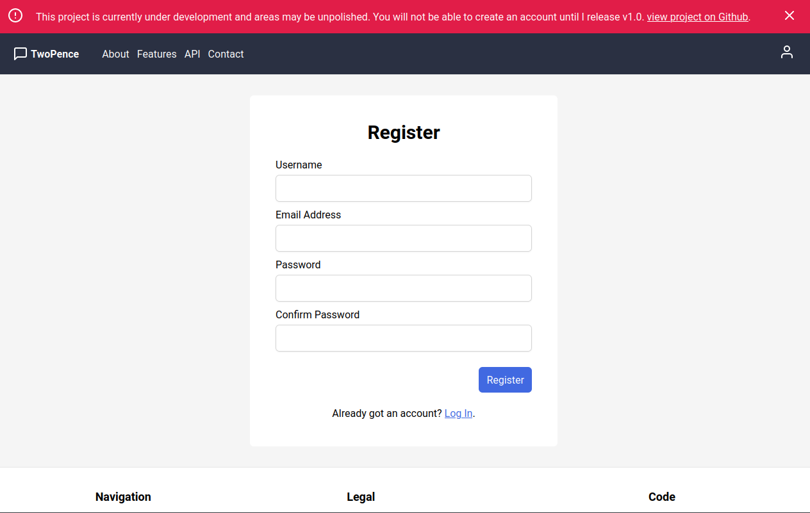
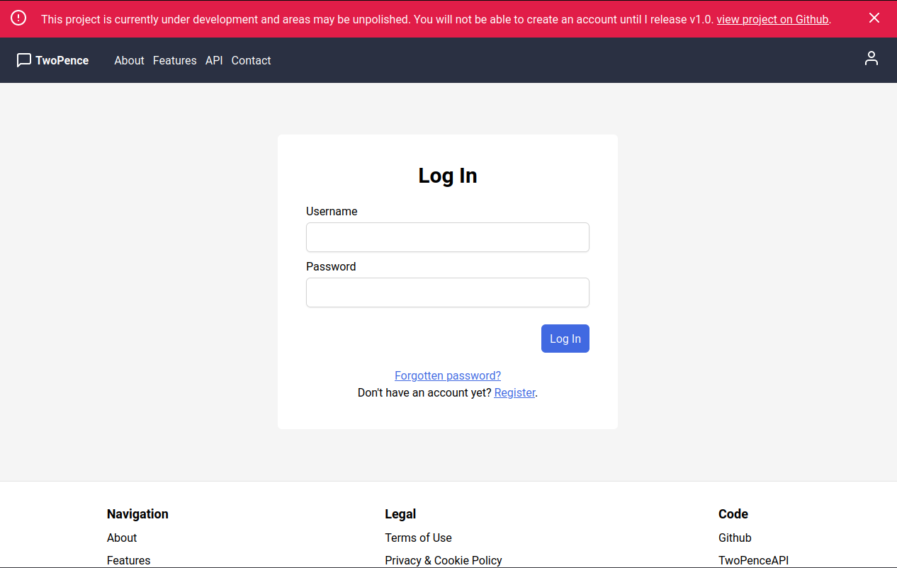
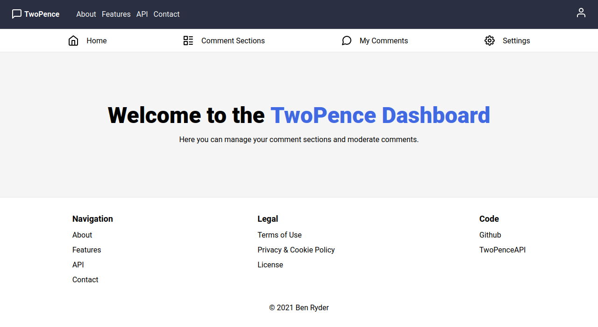
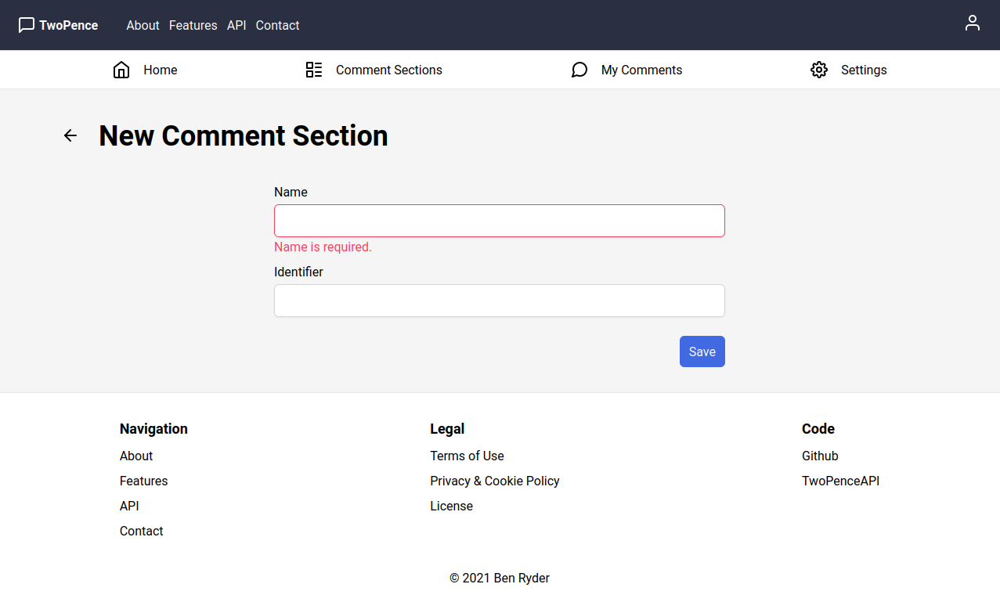
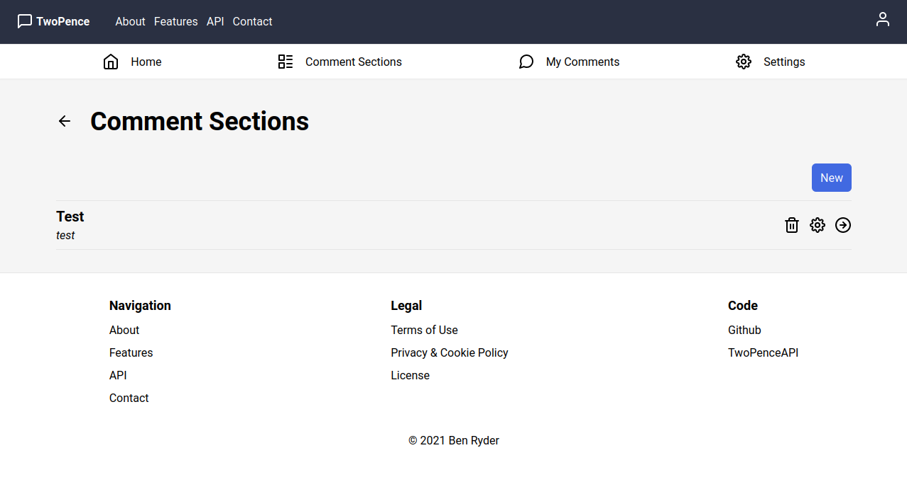
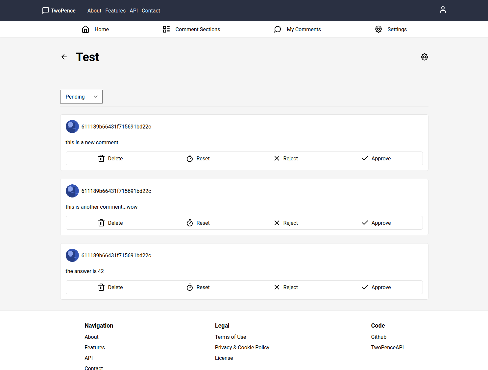
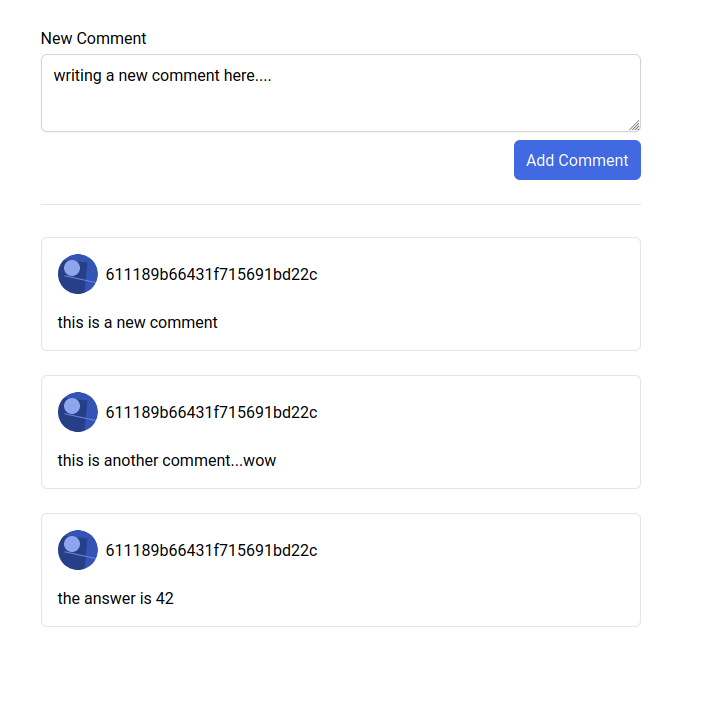

---
# Basic data
slug: 'two-pence'
title: 'Two Pence'
description: "A comments system and chat app allowing users to create comments sections and embed them on their sites for users to 'give their two pence'."
isFeatured: false
isPublished: true
tags:
  - apps
# Project data
# Timestamps
createdAt: 2022-08-14T00:00:00.000Z
updatedAt: 2024-05-28T00:00:00.000Z
# Related content
relatedBlogPosts: []
relatedProjects:
  - headbase
---

Two Pence is a project that I am currently working on. It will be a basic comments system allowing users to create comments sections and embed them on their sites for users to 'give their two pence'.
It will be built using ExpressJS, MongoDB, Gatsby (React) & Tailwind.

This project is still in early development so there is no public respository or live site right now. While I continue work on it, here's a sneak peek of where I'm up to so far...

**March 2022 Update**: I've stopped working on this project for now. I'm focusing on my KangoJS and Athena projects at the moment.

## Gallery

